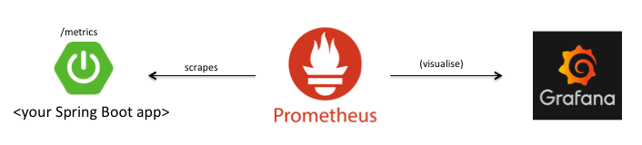
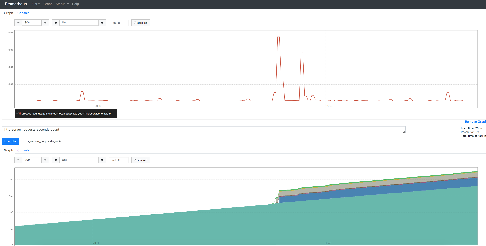
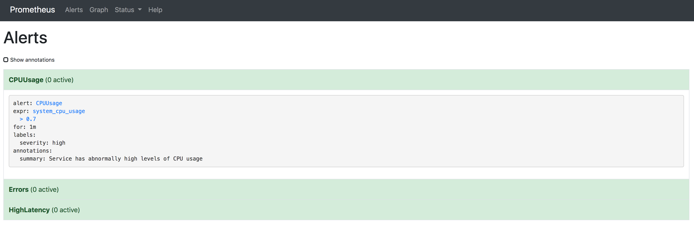
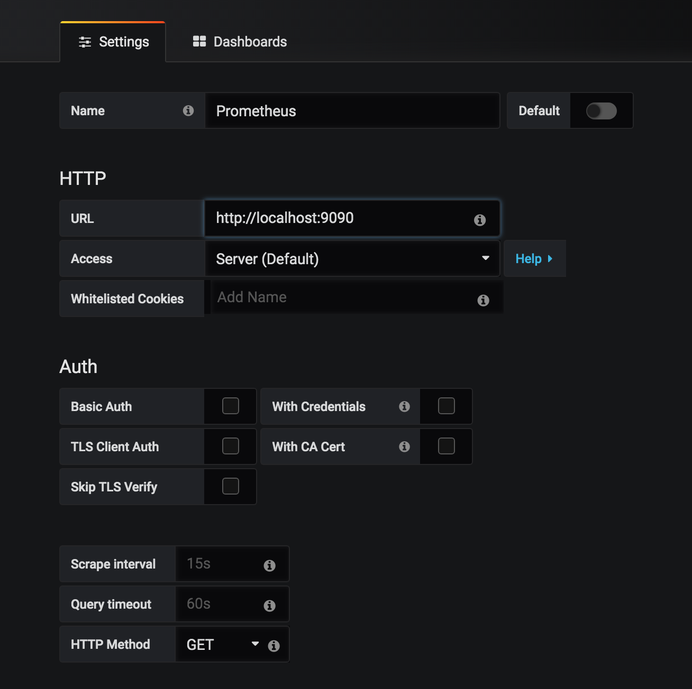
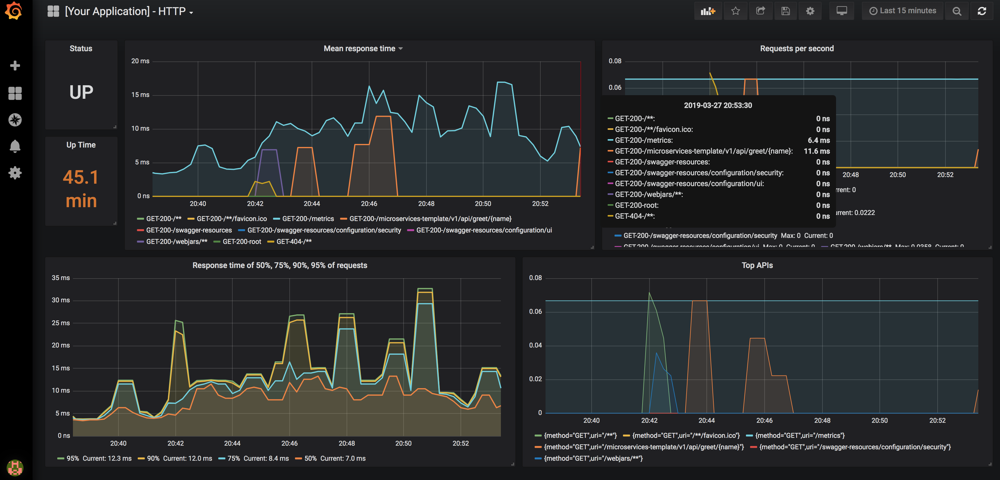
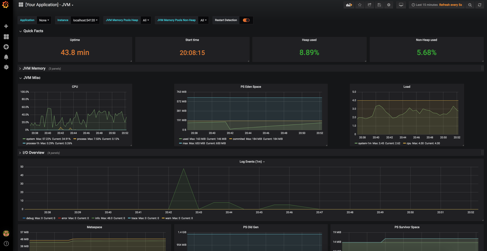

# Centralized Performance Monitoring with Prometheus & Grafana

## Performance Monitoring System

There requires 3 components in this monitoring system setup:

1. Your Spring Boot application
2. Prometheus (gather your application's metrics)
3. Grafana (for visualisation of your metrics data)



Prometheus is a pull-based system unlike the ELK stack where its a push-based system. Pull based means Prometheus actively pulls data from your application (by scrapping of your configured HTTP endpoint). In case of a Spring Boot app this would be your `/metrics` endpoint that comes as part of Spring Boot's Actuator. So you can see how easily Prometheus works really well with a Spring Boot app.

Prometheus stores the scrapped data in its own TSDB (Time Series Database). You can configure it to use an alternative Time Series Database like InfluxDB. However, for the simplicity of this demo repo I'm jsut going to use the default.

Lastly, Prometheus connects up to Grafana a visualisation tool (like Kibana from the ELK stack) for viewing dashboard of your gathered metrics data. 

From there, you can view and analyse the performance of your Spring Boot web apps.

### Use Case

This monitoring system is ideal for a modern spring boot application microservices architecture where most of the microservices are web based in such it exposes REST endpoints.

If you're system contains many legacy applications which are non RESTful backend web services but pure backend web-less applications or traditional web apps running on application servers/web containers that doesn't really use Spring Boot or expose REST endpoints... then this monitoring setup is perhaps not fit for your purpose. A more traditional ELK stack approach might be a better fit.

## Prometheus

Setup your application to be able to expose the metrics so Prometheus can scrape it (i.e. provide metrics Prometheus requires)
With a Spring Boot application this is very easy as all you need to do is add Spring Boot Actuator starter pack and configure in your configuration file to expose those data on the actuator endpoints (`/metrics`) thereby allowing Prometheus to pull from it (i.e. scrape it)

Very first step is to add in the required dependencies to your application:

1. Spring Boot Actuator
2. Micrometer-Core
3. Micrometer-Registry-Prometheus

Then these are the most important configuration you need in your Spring Boot application:

```yaml
management:
  metrics:
    export:
      prometheus:
        # enabling prometheus format metrics
        enabled: true
    distribution:
      #enabling percentile bucket exposure on metrics endpoint
      percentiles-histogram.http.server.requests: true 
    percentiles:
      # expose metrics for 95% and 99% percentile buckets
      http.server.requests: 0.95, 0.99
      # expose metric for requests that meet 50ms response time SLA
      sla.http.server.requests: 50ms
  endpoints:
    web:
      # by default Spring expose actuator endpoints on /actuator/ path but prometheus needs it be on /
      base-path: /
      exposure:
        include: "*"
      path-mapping:
        # prometheus looks at /metrics by default when scraping for metrics
        metrics: spring-metrics
        prometheus: metrics
```

See the sample `application.yml` in the application folder of this project repo as reference.

### Prometheus Configuration

Here is the sample `prometheus.yml` configuration file

```yaml
global:
  scrape_interval:     15s # Set the scrape interval to every 15 seconds. Default is every 1 minute.
  evaluation_interval: 15s # Evaluate rules every 15 seconds. The default is every 1 minute.
  # scrape_timeout is set to the global default (10s).

# Load rules once and periodically evaluate them according to the global 'evaluation_interval'.
rule_files:
   - "alerting-rules.yml"
  # - "second_rules.yml"

scrape_configs:
  # The job name is added as a label `job=<job_name>` to any timeseries scraped from this config.
  - job_name: 'your-application-name'

    # metrics_path defaults to '/metrics'
    # scheme defaults to 'http'.

    static_configs:
    - targets: ['localhost:8999']

```

The key configurations from above sample is ensuring the url and port in the targets section matches your application and the rule_files property configures the paths to the alerting rules files defined for prometheus to do the alerting via its AlertManager.

Prometheus contains graphs you can view:



in addition, you can look at the configured alerts:



Alerts show the alerts to fire off upon certain threshold of a metric is met. From there, you can configure the severity and for how long as well.

However, all this visualisation features of Prometheus is quite limited so that's why you use a specialised visualisation tool in Grafana so you can view your metric data in graphical format with great depth.

## Grafana

Grafana is a visualisation tool of metrics. Apparently, it is a sister project of Kibana. It was born out of a fork.

Default configuration settings that gets bundled with the grafana distribution is generally sufficient therefore just run Grafana.

Grafana default url is: http://localhost:3000

After running in your browser, you log in (default credentials is admin/admin)

First thing to do is to set up datasources which tells Grafana where to look for data to visualise:



Above just basically says get data from Prometheus default url (http://localhost:9090)

Next is to import the come with this repo dashboard configurations (in json format) for both HTTP and JVM visualisations.

Once the dashboards have been imported you will see the visualisations:

__HTTP metrics__


and

__JVM and Memory Metrics__



## Running the Performance Monitoring System

### Start up your application

#### Maven

```bash
mvn spring-boot:run
```

or if using maven wrapper:
```bash
./mvnw spring-boot:run
```

#### Gradle

```bash
gradle bootRun
```

or if using gradle wrapper:
```bash
./gradlew bootRun
```

### Start Prometheus

in the Prometheus distribution bin:

```bash
./prometheus --config.file=prometheus.yml
```

### Start Grafana

in the Grafana distribution bin:

```bash
./grafana-server
```